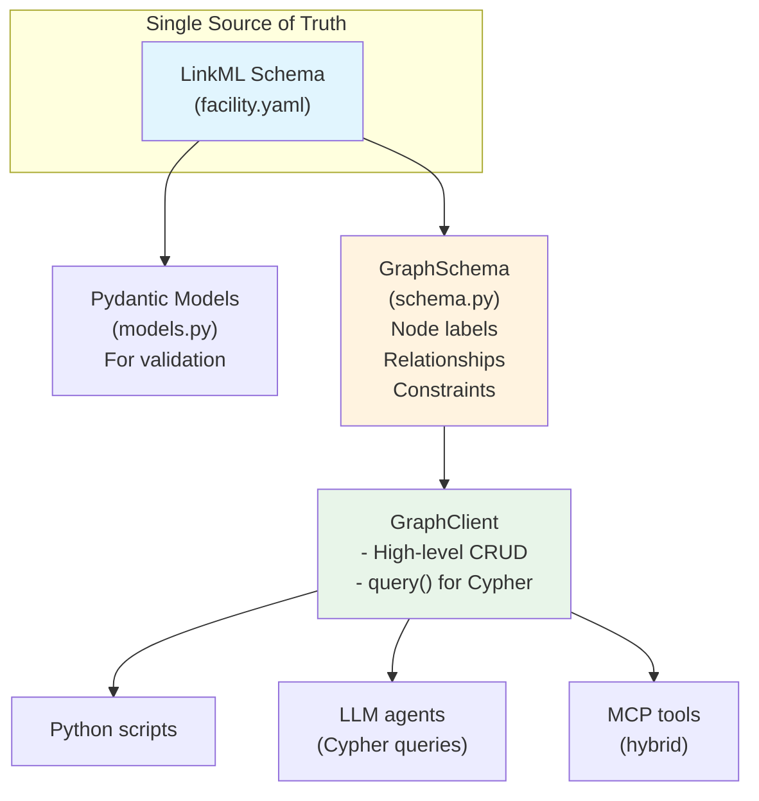

# Knowledge Graph Module

This module provides Neo4j-based storage for facility knowledge discovered through exploration.

## Architecture Overview



## Design Philosophy: LLM-First Cypher

Modern LLMs are excellent at writing Cypher queries. The architecture supports:

1. **Direct Cypher via `client.query()`** - Primary interface for LLM agents
2. **High-level Python methods** - Convenience for scripts and common operations
3. **Schema enforcement** - GraphSchema generates constraints from LinkML

```python
# LLM-generated Cypher (recommended for complex queries)
result = client.query("""
    MATCH (code:AnalysisCode {name: $name})-[:FACILITY_ID]->(f:Facility)
    RETURN f.id, f.name, code.version
    ORDER BY f.id
""", name="EFIT")

# High-level method (convenience for common patterns)
tools = client.get_tools("epfl")
```

## Multi-Facility Support

### Understanding `id` vs `facility_id`

| Field | Purpose | Example |
|-------|---------|---------|
| `id`/`name`/`path` | **Identifier** - uniquely identifies entity type | `"LIUQE"`, `"Thomson"` |
| `facility_id` | **Owner** - which facility this belongs to | `"epfl"`, `"jet"` |

**Both are required** to uniquely identify most nodes:

```
┌─────────────────────────────────────────────────────────────┐
│ AnalysisCode nodes in the graph:                            │
├─────────────────────────────────────────────────────────────┤
│ name: "EFIT"     facility_id: "epfl"  ← EPFL's EFIT         │
│ name: "EFIT"     facility_id: "jet"   ← JET's EFIT          │
│ name: "EFIT"     facility_id: "iter"  ← ITER's EFIT         │
└─────────────────────────────────────────────────────────────┘

Constraint: (name, facility_id) IS UNIQUE
```

### Cross-Facility Query Examples

**Find all facilities using a specific analysis code:**
```python
# Using Python accessor
efit_instances = client.get_nodes_across_facilities("AnalysisCode", name="EFIT")
facilities = [e["facility_id"] for e in efit_instances]
# ["epfl", "jet", "iter"]

# Using direct Cypher
facilities = client.query("""
    MATCH (c:AnalysisCode {name: $name})-[:FACILITY_ID]->(f:Facility)
    RETURN f.id, f.name, c.code_type, c.version
""", name="EFIT")
```

**Compare diagnostics across facilities:**
```python
comparison = client.compare_facilities(
    "Diagnostic", 
    facility_ids=["epfl", "jet", "iter"]
)
# {"epfl": [...], "jet": [...], "iter": [...]}
```

**Find shared IMAS mappings:**
```python
shared = client.find_shared_imas_mappings()
# [{"path": "equilibrium/time_slice/global_quantities/ip", 
#   "facilities": ["epfl", "jet", "iter"]}]
```

## Module Structure

```
graph/
├── __init__.py      # Public API exports
├── client.py        # Neo4j client for CRUD operations
├── schema.py        # Schema-driven graph ontology
└── models.py        # Auto-generated Pydantic models
```

## Schema-Driven Generation

From the LinkML schema (`schemas/facility.yaml`), we derive at runtime:

| Artifact | Source | Method |
|----------|--------|--------|
| Node labels | Class names | `schema.node_labels` |
| Relationships | Slots with class ranges | `schema.relationships` |
| Constraints | Identifier + facility_id | `schema.constraint_statements()` |
| Indexes | facility_id + common filters | `schema.index_statements()` |

### Composite Constraints for Multi-Facility

For facility-owned nodes, constraints are composite:
```cypher
-- Allows same name at different facilities
CREATE CONSTRAINT diagnostic_name IF NOT EXISTS 
FOR (n:Diagnostic) REQUIRE (n.name, n.facility_id) IS UNIQUE
```

## Usage

### GraphSchema - Schema Introspection

```python
from imas_codex.graph import GraphSchema, get_schema

schema = get_schema()

# Node labels (non-abstract classes)
print(schema.node_labels)
# ['Facility', 'MDSplusServer', 'MDSplusTree', ...]

# Relationships (slots with class ranges)
for rel in schema.relationships:
    print(f"{rel.from_class} -[:{rel.cypher_type}]-> {rel.to_class}")

# Check if class needs composite constraint
schema.needs_composite_constraint("Diagnostic")  # True
schema.needs_composite_constraint("Facility")     # False (no facility_id)
```

### GraphClient - Neo4j Operations

```python
from imas_codex.graph import GraphClient

with GraphClient() as client:
    # Initialize schema (creates constraints and indexes)
    client.initialize_schema()
    
    # High-level CRUD
    client.create_facility("epfl", name="EPFL/TCV", machine="TCV")
    client.create_tool("epfl", name="git", available=True, category="vcs")
    
    # Direct Cypher for complex queries
    result = client.query("""
        MATCH (t:Tool)-[:FACILITY_ID]->(f:Facility)
        WHERE t.available = true
        RETURN f.id, collect(t.name) as tools
    """)
```

## Schema Patterns

### Relationships from LinkML

Slots with class ranges automatically become relationships:

```yaml
classes:
  MDSplusServer:
    attributes:
      facility_id:            # Creates FACILITY_ID relationship
        range: Facility       # Target node type
        required: true
```

### Identifier Fields → Constraints

```yaml
classes:
  Facility:
    attributes:
      id:
        identifier: true    # → Simple UNIQUE constraint
        
  Diagnostic:
    attributes:
      name:
        identifier: true    # → Composite constraint with facility_id
      facility_id:
        required: true
```

## Regenerating Models

When the LinkML schema changes:

```bash
uv run build-models --force
```

## Testing

```bash
docker-compose up neo4j -d
uv run pytest tests/graph/ -v
```

## References

- [LinkML Schema](../schemas/facility.yaml) - Source of truth
- [Neo4j Cypher Manual](https://neo4j.com/docs/cypher-manual/current/)
- [linkml-store](https://linkml.io/linkml-store/) - Alternative abstraction
