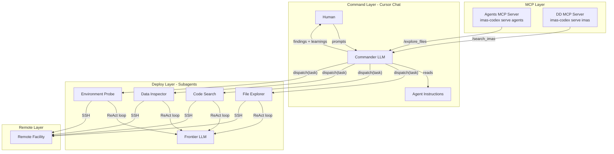
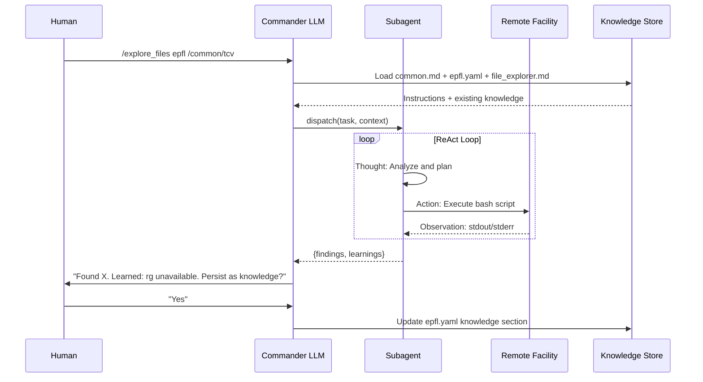

# Codex: The Federated Fusion Knowledge Graph Builder

**System:** `imas-codex`
**Role:** The Factory (Backend Engineering & Ontology Management)
**Output:** A versioned, containerized Neo4j Database Artifact

---

## 1. Executive Vision

**Codex** is the engineering engine that constructs the "Map" of the fusion world. It does not serve user requests directly; instead, it produces the **Federated Fusion Knowledge Graph (FFKG)**—a comprehensive, versioned artifact that links facility-specific data (Source) to the IMAS standard (Target).

**Core Philosophy: "Graph-as-Code"**
We do not manually draw a graph. We engineer a software pipeline. The graph is the deterministic output of running:
1.  **Discovery Engine** (Command/Deploy Agent Architecture)
2.  **Ontology** (Agile LinkML definitions)
3.  **Logic Synthesis** (LLM-driven mapping)

---

## 2. Architecture: The Four-Zone Topology

The graph is structured into four distinct zones of "Truth":

| Zone | Name | Role | Source of Truth |
| :--- | :--- | :--- | :--- |
| **Zone A** | **Target Definition** (IMAS) | The immutable standard we map *to*. | **IMAS Python Library** (`imas.dd`) |
| **Zone B** | **Source Inventory** (Facility) | The catalog of what exists (Files, Trees). | **Discovery Engine** (Subagents) |
| **Zone C** | **Forensic Evidence** (Context) | Documentation, legacy code, diagrams. | **Discovery Engine** (Subagents) |
| **Zone D** | **Transformation Logic** (The Bridge) | The computed link between Source and Target. | **LLM / LinkML** |

---

## 3. The Agile Schema Workflow (LinkML)

We reject the "Waterfall" approach to ontology. The schema must evolve as we discover new patterns in the wild.

### 3.1 The "Core" vs. "Wild" Split
The LinkML definitions (stored in `ontology/`) are divided:
*   **`ontology/core.yaml`**: Rigid definitions for Zone A (IMAS) and base classes.
*   **`ontology/wild.yaml`**: Permissive definitions for Zone B (Facility). Initially contains generic `RawArtifact` nodes.

### 3.2 The "LLM-as-Ontologist" Loop
1.  **Discover:** Subagents scan the facility and return structured findings.
2.  **Ingest:** The pipeline attempts to validate findings against current LinkML models.
3.  **Identify Misses:** Data that fails validation (e.g., a new file type "FastCameraLog") is flagged.
4.  **Synthesize:** An LLM Agent analyzes the "Misses" and **generates a Schema Proposal (Pull Request)**:
    *   It defines a new class `FastCameraLog` in `ontology/wild.yaml`.
    *   It adds the necessary attributes found in the raw JSON.
5.  **Validate:** A human engineer (or senior agent) reviews the PR. CI/CD runs `linkml-validate` to ensure the new definition doesn't break the graph.

---

## 4. Implementation Strategy

### 4.1 The Discovery Engine (Zone B/C) - Command/Deploy Architecture

The discovery process uses a **Command/Deploy** agent architecture where a Commander LLM orchestrates specialist subagents for remote facility exploration.

#### Architecture Overview



#### Knowledge Flow



#### Knowledge Hierarchy

Agent instructions are organized in a three-level hierarchy:

| Level | Format | Location | Content |
|-------|--------|----------|---------|
| **Common** | Markdown | `prompts/agents/common.md` | Safety rules, ReAct pattern, SSH execution |
| **Facility** | YAML | `config/facilities/*.yaml` | Paths, tools, accumulated knowledge |
| **Specialist** | Markdown | `prompts/agents/*.md` | Agent-specific behavior and goals |

#### Available Subagents

| Agent | Status | Purpose | MCP Prompt |
|-------|--------|---------|------------|
| **File Explorer** | ✅ Available | Map filesystem structure | `/explore_files` |
| **Code Search** | 🔜 Planned | Find code patterns | `/search_code` |
| **Data Inspector** | 🔜 Planned | Inspect HDF5/MDSplus data | `/inspect_data` |
| **Environment Probe** | 🔜 Planned | Discover system capabilities | `/probe_environment` |
| **Dependency Mapper** | 🔜 Planned | Map code dependencies | `/map_dependencies` |
| **Documentation Finder** | 🔜 Planned | Locate and index docs | `/find_documentation` |

#### Safety Model

All subagents execute within a **Read-Only Sandbox** that:
- Whitelists non-destructive commands (`ls`, `find`, `grep`, `cat`, etc.)
- Blocks dangerous commands (`rm`, `mv`, `sudo`, etc.)
- Enforces output size limits
- Times out long-running commands

### 4.2 The Builder Pipeline
A containerized Python application that:
1.  Reads `config/{machine}.yaml`.
2.  **Phase 1:** Executes the **File Explorer** agent to populate the Zone B skeleton.
3.  **Phase 2:** The **Code Search** and **Data Inspector** agents iterate through interesting nodes.
4.  **Phase 3:** Synthesizes Zone D (Logic) and populates Neo4j.

### 4.3 Quality Assurance (CI/CD)
Since the LLM can modify the schema, we need rigorous checks.

*   **Pre-Commit Hook:**
    *   Runs `linkml-lint` on `ontology/*.yaml`.
    *   Ensures no breaking changes to `core.yaml`.
*   **CI Pipeline:**
    *   Generates Pydantic models from LinkML.
    *   Runs a "Dry Run" ingestion with sample data.
    *   If successful, merges the schema update.

---

## 5. MCP Server Architecture

The system runs two separate MCP servers:

| Server | Command | Purpose | Transport |
|--------|---------|---------|-----------|
| **IMAS DD** | `imas-codex serve imas` | IMAS Data Dictionary knowledge | HTTP (public) |
| **Agents** | `imas-codex serve agents` | Facility exploration prompts | stdio (local) |

### MCP Configuration

```json
{
  "mcpServers": {
    "imas-dd": {
      "url": "https://imas-dd.iter.org/mcp",
      "type": "http"
    },
    "agents": {
      "command": "uv",
      "args": ["run", "imas-codex", "serve", "agents"],
      "type": "stdio"
    }
  }
}
```

---

## 6. Artifact Management & Versioning

We treat the Database as an Artifact.

1.  **Build:** The pipeline runs and populates a local Neo4j instance.
2.  **Dump:** Run `neo4j-admin database dump`.
3.  **Package:** Wrap the dump in an OCI-compliant container layer.
4.  **Publish:** Push to **GitHub Container Registry (GHCR)**.
    *   Tag: `ghcr.io/iter/imas-codex-graph:sha-12345`
5.  **Traceability:** The Git commit hash of the `imas-codex` repo is the single source of truth. It references the specific GHCR tag used for that version.

---

## 7. Roadmap

### Phase 1: Foundation ✅
- [x] Setup `imas-codex` repo with `ontology/` folder
- [x] Implement basic LinkML setup
- [x] IMAS DD MCP server with semantic search

### Phase 2: Command/Deploy Architecture ✅
- [x] Restructure CLI (`serve imas`, `serve agents`)
- [x] Agent knowledge hierarchy (common → facility → specialist)
- [x] File Explorer subagent demonstrator
- [x] Agents MCP server for prompts

### Phase 3: Neo4j Knowledge Graph ✅
- [x] Neo4j integration with Apptainer
- [x] GraphClient with Cypher query API
- [x] Schema-driven graph structure from LinkML
- [x] OCI artifact versioning (GHCR push/pull)
- [x] `get_exploration_progress` with per-tree coverage
- [x] `get_graph_schema` for LLM Cypher generation

### Phase 4: MDSplus Ingestion 🔜 (Current Focus)
- [x] TDI function discovery (VERSION.FUN pattern)
- [x] Variant/source mapping (tcv_eq pattern)
- [x] Shot-range validity tracking
- [x] Analysis code versioning
- [ ] Tree structure ingestion (equilibrium subtree)
- [ ] IMAS mapping generation

### Phase 5: Subagent Expansion 🔜
- [ ] Code Search agent
- [ ] Data Inspector agent (HDF5, MDSplus)
- [ ] Environment Probe agent
- [ ] TDI Parser agent

### Phase 6: CI/CD & Artifacts 🔜
- [ ] Automated graph builds
- [ ] GHCR publishing pipeline
- [ ] Version traceability
